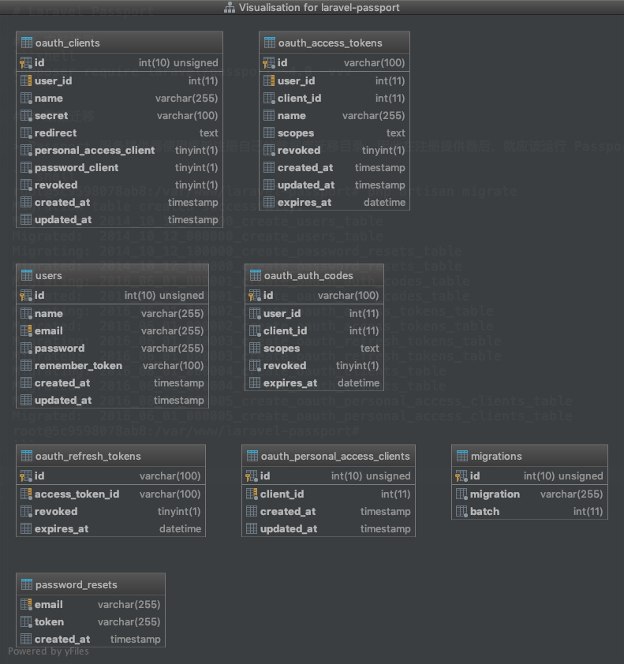
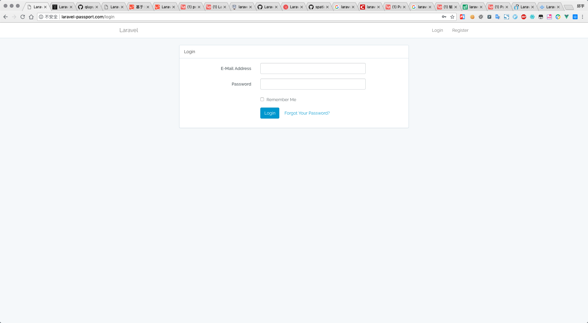
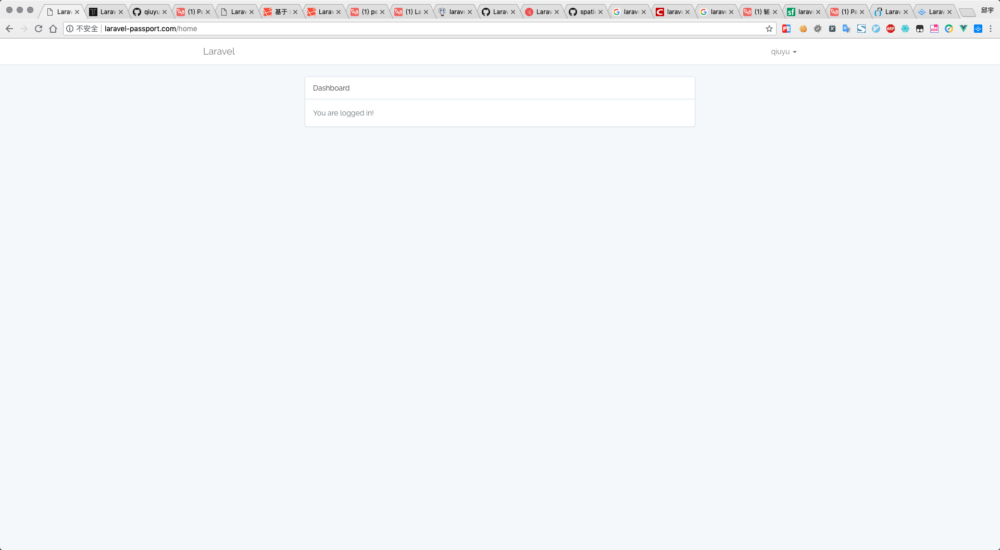
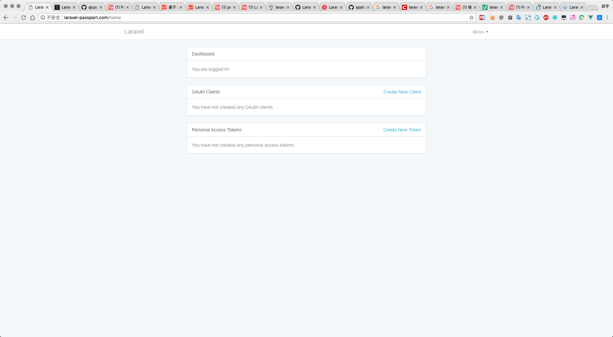
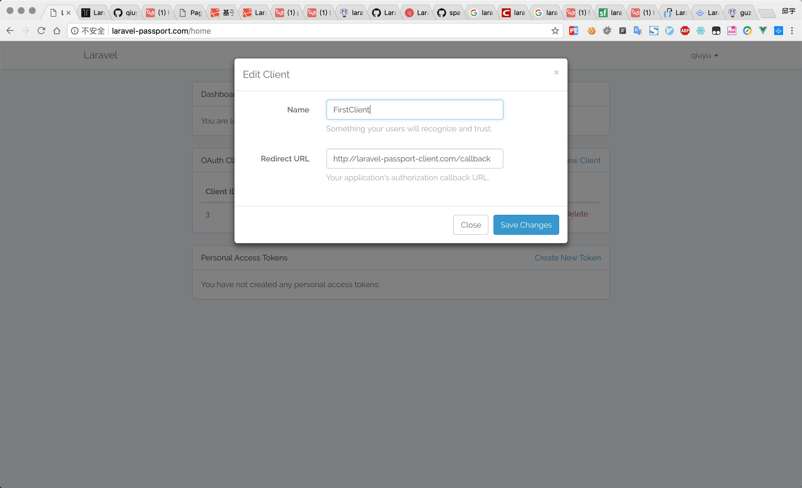
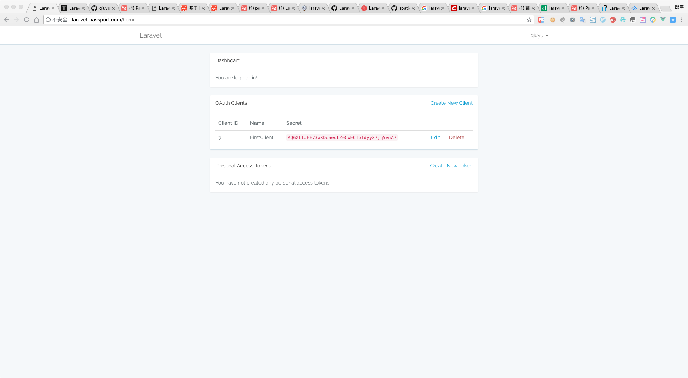
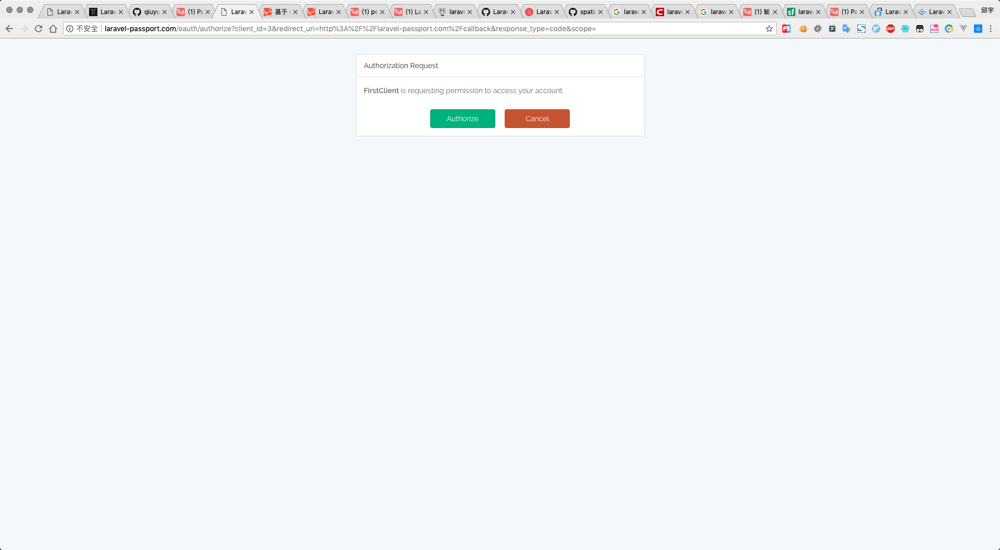
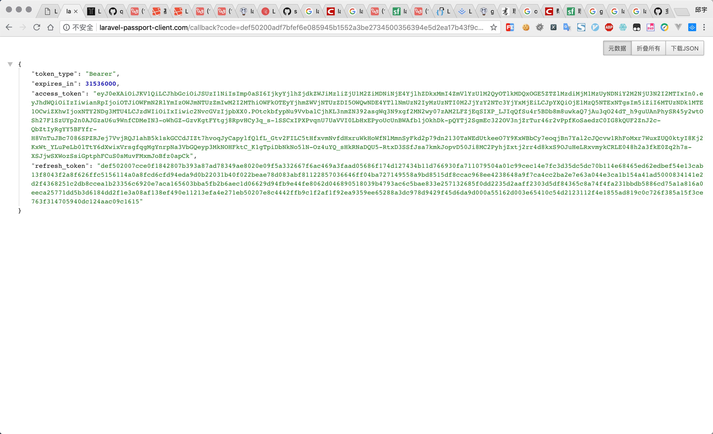

# Laravel Passport

### 安装扩展
```shell
composer require laravel/passport=~4.0 -vvv
```

### 数据迁移

> Passport 服务提供器使用框架注册自己的数据库迁移目录，因此在注册提供器后，就应该运行 Passport 的迁移命令来自动创建存储客户端和令牌的数据表.

```shell
root@5c9598078ab8:/var/www/laravel-passport# php artisan migrate
Migration table created successfully.
Migrating: 2014_10_12_000000_create_users_table
Migrated:  2014_10_12_000000_create_users_table
Migrating: 2014_10_12_100000_create_password_resets_table
Migrated:  2014_10_12_100000_create_password_resets_table
Migrating: 2016_06_01_000001_create_oauth_auth_codes_table
Migrated:  2016_06_01_000001_create_oauth_auth_codes_table
Migrating: 2016_06_01_000002_create_oauth_access_tokens_table
Migrated:  2016_06_01_000002_create_oauth_access_tokens_table
Migrating: 2016_06_01_000003_create_oauth_refresh_tokens_table
Migrated:  2016_06_01_000003_create_oauth_refresh_tokens_table
Migrating: 2016_06_01_000004_create_oauth_clients_table
Migrated:  2016_06_01_000004_create_oauth_clients_table
Migrating: 2016_06_01_000005_create_oauth_personal_access_clients_table
Migrated:  2016_06_01_000005_create_oauth_personal_access_clients_table
root@5c9598078ab8:/var/www/laravel-passport#
```





### 生成加密密钥和客户端

> 运行 `passport:install` 命令来创建生成安全访问令牌时所需的加密密钥，同时，这条命令也会创建用于生成访问令牌的「个人访问」客户端和「密码授权」客户端.

```shell
root@5c9598078ab8:/var/www/laravel-passport# php artisan passport:install
Encryption keys generated successfully.
Personal access client created successfully.
Client ID: 1
Client Secret: gU68wwnmgE9GjF4GIEZJt8rqdLEq5KVLmI1fwHC6
Password grant client created successfully.
Client ID: 2
Client Secret: wnL0pmoHnXnIlncWIdk1ZbD8SlOQfL5gP1n1z0X5
root@5c9598078ab8:/var/www/laravel-passport#
```

*目前还不知道这个有什么用*


### App\User 中添加trait

> 将 `Laravel\Passport\HasApiTokens` Trait 添加到 `App\User` 模型中，这个 Trait 会给你的模型提供一些辅助函数，用于检查已认证用户的令牌和使用范围.

`app/User.php`

```php
<?php

namespace App;

use Illuminate\Notifications\Notifiable;
use Illuminate\Foundation\Auth\User as Authenticatable;
use Laravel\Passport\HasApiTokens;

class User extends Authenticatable
{
    use Notifiable;
    use HasApiTokens;   // 在这里引用trait, 别忘了上面声明使用的命名空间.

    /**
     * The attributes that are mass assignable.
     *
     * @var array
     */
    protected $fillable = [
        'name', 'email', 'password',
    ];

    /**
     * The attributes that should be hidden for arrays.
     *
     * @var array
     */
    protected $hidden = [
        'password', 'remember_token',
    ];
}

```


### AuthServiceProvider 中注册路由

> 在 `AuthServiceProvider` 的 `boot` 方法中调用 `Passport::routes` 函数。这个函数会注册发出访问令牌并撤销访问令牌、客户端和个人访问令牌所必需的路由

`app/Providers/AuthServiceProvider.php`

```php
<?php

namespace App\Providers;

use Illuminate\Support\Facades\Gate;
use Illuminate\Foundation\Support\Providers\AuthServiceProvider as ServiceProvider;
use Laravel\Passport\Passport;

class AuthServiceProvider extends ServiceProvider
{
    /**
     * The policy mappings for the application.
     *
     * @var array
     */
    protected $policies = [
        'App\Model' => 'App\Policies\ModelPolicy',
    ];

    /**
     * Register any authentication / authorization services.
     *
     * @return void
     */
    public function boot()
    {
        $this->registerPolicies();

        // 注册 passport 路由
        Passport::routes();
    }
}

```

### 更改 guard 为 passport

> 将配置文件 `config/auth.php` 中授权看守器 `guards` 的 `api` 的 `driver` 选项改为 `passport`。此调整会让你的应用程序在在验证传入的 API 的请求时使用 Passport 的 `TokenGuard` 来处理

```php
'guards' => [
    'web' => [
        'driver' => 'session',
        'provider' => 'users',
    ],

    'api' => [
        'driver' => 'passport',
        'provider' => 'users',
    ],
],
```

### 登录注册功能

Laravel 自带的. 

```shell
root@5c9598078ab8:/var/www/laravel-passport# php artisan make:auth
Authentication scaffolding generated successfully.
root@5c9598078ab8:/var/www/laravel-passport#
```

> 会生成一个 view 文件: ` home.blade.php`, 下一步会用到. 



注册一个账户. 完成后如下: 



### 使用 vue 组件

```shell
root@5c9598078ab8:/var/www/laravel-passport# php artisan vendor:publish --tag=passport-components
Copied Directory [/vendor/laravel/passport/resources/assets/js/components] To [/resources/assets/js/components/passport]
Publishing complete.
root@5c9598078ab8:/var/www/laravel-passport#
```

> 在 `resources/assets/js/components/passport` 生成了 vue 的 passport 组件. 

在 `home.blade.php` 中使用组件. 


```php
@extends('layouts.app')

@section('content')
<div class="container">
    <div class="row">
        <div class="col-md-8 col-md-offset-2">
            <div class="panel panel-default">
                <div class="panel-heading">Dashboard</div>

                <div class="panel-body">
                    @if (session('status'))
                        <div class="alert alert-success">
                            {{ session('status') }}
                        </div>
                    @endif

                    You are logged in!
                </div>
            </div>

            {{-- 使用 passport 组件 --}}
            <passport-clients></passport-clients>
            <passport-authorized-clients></passport-authorized-clients>
            <passport-personal-access-tokens></passport-personal-access-tokens>
        </div>
    </div>
</div>
@endsection

```


21 行到 24 行.  使用了 passport 组件.

```php
            {{-- 使用 passport 组件 --}}
            <passport-clients></passport-clients>
            <passport-authorized-clients></passport-authorized-clients>
            <passport-personal-access-tokens></passport-personal-access-tokens>
```


### 打包前端

* `npm install`: 安装 npm 包
* npm run dev: 打包


```shell
root@5c9598078ab8:/var/www/laravel-passport# npm install
npm WARN deprecated browserslist@2.11.3: Browserslist 2 could fail on reading Browserslist >3.0 config used in other tools.
npm WARN deprecated browserslist@1.7.7: Browserslist 2 could fail on reading Browserslist >3.0 config used in other tools.
npm WARN deprecated gulp-util@3.0.8: gulp-util is deprecated - replace it, following the guidelines at https://medium.com/gulpjs/gulp-util-ca3b1f9f9ac5

> node-sass@4.9.3 install /var/www/laravel-passport/node_modules/node-sass
> node scripts/install.js

Downloading binary from https://github.com/sass/node-sass/releases/download/v4.9.3/linux-x64-64_binding.node
Download complete  ] - :
Binary saved to /var/www/laravel-passport/node_modules/node-sass/vendor/linux-x64-64/binding.node

> uglifyjs-webpack-plugin@0.4.6 postinstall /var/www/laravel-passport/node_modules/webpack/node_modules/uglifyjs-webpack-plugin
> node lib/post_install.js


> node-sass@4.9.3 postinstall /var/www/laravel-passport/node_modules/node-sass
> node scripts/build.js

Binary found at /var/www/laravel-passport/node_modules/node-sass/vendor/linux-x64-64/binding.node
Testing binary
Binary is fine

> gifsicle@3.0.4 postinstall /var/www/laravel-passport/node_modules/gifsicle
> node lib/install.js

  ✔ gifsicle pre-build test passed successfully

> mozjpeg@5.0.0 postinstall /var/www/laravel-passport/node_modules/mozjpeg
> node lib/install.js

  ⚠ The `/var/www/laravel-passport/node_modules/mozjpeg/vendor/cjpeg` binary doesn't seem to work correctly
  ⚠ mozjpeg pre-build test failed
  ℹ compiling from source
  ✔ mozjpeg built successfully

> optipng-bin@3.1.4 postinstall /var/www/laravel-passport/node_modules/optipng-bin
> node lib/install.js

  ✔ optipng pre-build test passed successfully

> pngquant-bin@4.0.0 postinstall /var/www/laravel-passport/node_modules/pngquant-bin
> node lib/install.js

  ✔ pngquant pre-build test passed successfully
npm notice created a lockfile as package-lock.json. You should commit this file.
npm WARN ajv-keywords@3.2.0 requires a peer of ajv@^6.0.0 but none is installed. You must install peer dependencies yourself.
npm WARN optional SKIPPING OPTIONAL DEPENDENCY: fsevents@1.2.4 (node_modules/fsevents):
npm WARN notsup SKIPPING OPTIONAL DEPENDENCY: Unsupported platform for fsevents@1.2.4: wanted {"os":"darwin","arch":"any"} (current: {"os":"linux","arch":"x64"})

added 1534 packages from 755 contributors and audited 17897 packages in 284.552s
found 7 moderate severity vulnerabilities
  run `npm audit fix` to fix them, or `npm audit` for details
root@5c9598078ab8:/var/www/laravel-passport#
root@5c9598078ab8:/var/www/laravel-passport# npm run dev

> @ dev /var/www/laravel-passport
> npm run development


> @ development /var/www/laravel-passport
> cross-env NODE_ENV=development node_modules/webpack/bin/webpack.js --progress --hide-modules --config=node_modules/laravel-mix/setup/webpack.config.js

 95% emitting
 DONE  Compiled successfully in 13128ms          4:38:26 PM

                                                                                                    Asset     Size  Chunks                    Chunk Names
  fonts/vendor/bootstrap-sass/bootstrap/glyphicons-halflings-regular.eot?f4769f9bdb7466be65088239c12046d1  20.1 kB          [emitted]
fonts/vendor/bootstrap-sass/bootstrap/glyphicons-halflings-regular.woff2?448c34a56d699c29117adc64c43affeb    18 kB          [emitted]
 fonts/vendor/bootstrap-sass/bootstrap/glyphicons-halflings-regular.woff?fa2772327f55d8198301fdb8bcfc8158  23.4 kB          [emitted]
  fonts/vendor/bootstrap-sass/bootstrap/glyphicons-halflings-regular.ttf?e18bbf611f2a2e43afc071aa2f4e1512  45.4 kB          [emitted]
  fonts/vendor/bootstrap-sass/bootstrap/glyphicons-halflings-regular.svg?89889688147bd7575d6327160d64e760   109 kB          [emitted]
                                                                                               /js/app.js   1.3 MB       0  [emitted]  [big]  /js/app
                                                                                             /css/app.css   147 kB       0  [emitted]         /js/app
root@5c9598078ab8:/var/www/laravel-passport#

```


现在的页面如下:




## 使用






我们可以去创建一个客户端 因为我们的数据要为很多的客户端服务 如果一个客户端需要访问我们的数据我们就可以为他创建一个客户端

其实这样的应用场景可以想象的就是 当我们比如安卓的`app`需要使用服务端的数据 可能多个`app`会使用到同一组数据

那么为了辨识 我们就需要为每个客户端创建一个`client` 并提供一个回调地址

如果做过第三方授权的就知道了 无论我们是做分享还是授权登陆 我们需要为我们这个客户端提供`appID`,回调地址

所以这里我们可以先去创建一个客户端

应户名就为`codespace` 回调 `url`为:`http://laravel-passport.com/callback`

创建完成之后就会给出我们的`clientId`和`clientSecret`这些是不是很熟悉 其实我们的服务端为我们生成的也就是客户端所需要的这些`id`和`secret`

而这个在数据库中的表现就是`oauth_clients`表中 生成了对应的客户端数据(也就是我们刚刚所创建的)

### 新建 laravel-passport-client 项目

新建项目, 修改 web 路由.

```php
<?php

/*
|--------------------------------------------------------------------------
| Web Routes
|--------------------------------------------------------------------------
|
| Here is where you can register web routes for your application. These
| routes are loaded by the RouteServiceProvider within a group which
| contains the "web" middleware group. Now create something great!
|
*/

use Illuminate\Http\Request;

Route::get('/', function () {
    return view('welcome');
});

/**
 * passport client test
 */
Route::get('/redirect', function () {
    $query = http_build_query([
        'client_id' => 3,
        'redirect_uri' => 'http://laravel-passport-client.com/callback',
        'response_type' => 'code',
        'scope' => '',
    ]);

    return redirect('http://laravel-passport.com/oauth/authorize?'.$query);
});

/**
 * passport callback
 */
Route::get('/callback', function (Request $request) {
    $http = new GuzzleHttp\Client;

    $response = $http->post('http://laravel-passport.com/oauth/token', [
        'form_params' => [
            'grant_type' => 'authorization_code',
            'client_id' => 3,
            'client_secret' => 'KQ6XLIJFE73xXDuneqLZeCWEOTo1dyyX7jq5vmA7',
            'redirect_uri' => 'http://laravel-passport-client.com/callback',
            'code' => $request->code,
        ],
    ]);

    return json_decode((string) $response->getBody(), true);
});

```

注意: 这里的 `client_id`, 就是我刚刚注册的. 看上一个图.


在客户端访问. 

`http://laravel-passport-client.com/redirect`







至此, 已经拿到了访问令牌和刷新令牌. 